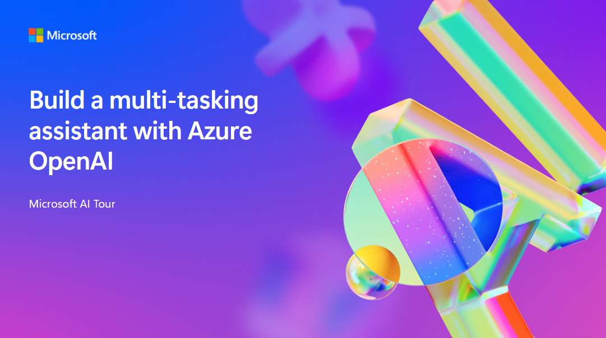

# Build a multi-tasking asssistant with Azure OpenAI

This repo is a companion to this workshop at Microsoft AI Tour, a worldwide tour of events.

> Learn more about Microsoft AI Tour on the official website.

## Session Desciption

In this workshop attendees will be introduced to the concept of Agents, an approach in AI that combines thought and action using LLMs and tools to achieve a desired goal. The sample presented will demonstrates how to create a Python app that takes a topic and instruction from a user then calls a research agent that uses the Bing Search API to research the topic, a product agent that uses Azure AI Search to do a semantic similarity search for related products from a vector store, a writer agent to combine the research and product information into a helpful article, and an editor agent to refine the article that's finally presented to the user. 

## Learning Outcomes

Implement a real world LLM-basedd agent lifecycle
- Understand agents and prompt engineering with [Prompty](https://prompty.ai)
- Utilize tracing for debugging and observability
- Build and run Contoso Creative Writer
- Set up automated evaluations with GitHub Actions

## Technology Used
- Backend application
  - Prompty
  - FastAPI
  - OpenTelemetry
- Frontend application
  - React
  - Typescript
  - ViteJS
- AI Models
  - GPT-4o
  - GPT-3.5 Turbo
- Tools
  - Azure AI Search
  - Bing Search
- Monitoring
  - AppInsights
  - Promptflow tracing
- Infra
  - Azure Container Applications (ACA)
  - Azure AI Hub
  - Managed identity
  - Key vault
- Infra as code
  - azd (Azure Developer CLI)
- CI/CD
  - Github Actions

## Additional Resources and Continued Learning
If you will present this talk, you can find the [trainer resources here](./train-the-trainer/README.md). 

| Resources          | Links                             | Description        |
|:-------------------|:----------------------------------|:-------------------|
| Prompty  | [Learn more](https://prompty.ai) | Learn more about Prompty, a new asset class and format for LLM prompts that aims to provide observability, understandability, and portability for developers |
| AI for Developers | [Learn more](https://developer.microsoft.com/en-us/ai#ai-solutions) | Learn more about different Microsoft AI tools and services for Developers |

## Content Owners

<!-- ALL-CONTRIBUTORS-LIST:START - Do not remove or modify this section -->

<table>
<tr>
    <td align="center"><a href="http://learnanalytics.microsoft.com">
         
        <b>Marlene Mhangami
</b></a> 
            <a href="https://github.com/marlenezq" title="talk">📢</a> 
    </td>
    <td align="center"><a href="http://learnanalytics.microsoft.com">
         
        <b>Cassie Breviu
</b></a> 
            <a href="https://github.com/Cassie Breviu" title="talk">📢</a> 
    </td>
</tr>
</table>

<!-- ALL-CONTRIBUTORS-LIST:END -->

## Responsible AI 

Microsoft is committed to helping our customers use our AI products responsibly, sharing our learnings, and building trust-based partnerships through tools like Transparency Notes and Impact Assessments. Many of these resources can be found at [https://aka.ms/RAI](https://aka.ms/RAI).
Microsoft’s approach to responsible AI is grounded in our AI principles of fairness, reliability and safety, privacy and security, inclusiveness, transparency, and accountability.

Large-scale natural language, image, and speech models - like the ones used in this sample - can potentially behave in ways that are unfair, unreliable, or offensive, in turn causing harms. Please consult the [Azure OpenAI service Transparency note](https://learn.microsoft.com/legal/cognitive-services/openai/transparency-note?tabs=text) to be informed about risks and limitations.

The recommended approach to mitigating these risks is to include a safety system in your architecture that can detect and prevent harmful behavior. [Azure AI Content Safety](https://learn.microsoft.com/azure/ai-services/content-safety/overview) provides an independent layer of protection, able to detect harmful user-generated and AI-generated content in applications and services. Azure AI Content Safety includes text and image APIs that allow you to detect material that is harmful. Within Azure AI Studio, the Content Safety service allows you to view, explore and try out sample code for detecting harmful content across different modalities. The following [quickstart documentation](https://learn.microsoft.com/azure/ai-services/content-safety/quickstart-text?tabs=visual-studio%2Clinux&pivots=programming-language-rest) guides you through making requests to the service.

Another aspect to take into account is the overall application performance. With multi-modal and multi-models applications, we consider performance to mean that the system performs as you and your users expect, including not generating harmful outputs. It's important to assess the performance of your overall application using [Performance and Quality and Risk and Safety evaluators](https://learn.microsoft.com/azure/ai-studio/concepts/evaluation-metrics-built-in). You also have the ability to create and evaluate with [custom evaluators](https://learn.microsoft.com/azure/ai-studio/how-to/develop/evaluate-sdk#custom-evaluators).

You can evaluate your AI application in your development environment using the [Azure AI Evaluation SDK](https://microsoft.github.io/promptflow/index.html). Given either a test dataset or a target, your generative AI application generations are quantitatively measured with built-in evaluators or custom evaluators of your choice. To get started with the azure ai evaluation sdk to evaluate your system, you can follow the [quickstart guide](https://learn.microsoft.com/azure/ai-studio/how-to/develop/flow-evaluate-sdk). Once you execute an evaluation run, you can [visualize the results in Azure AI Studio](https://learn.microsoft.com/azure/ai-studio/how-to/evaluate-flow-results).

